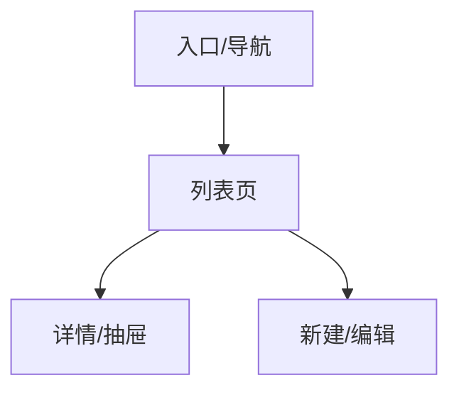
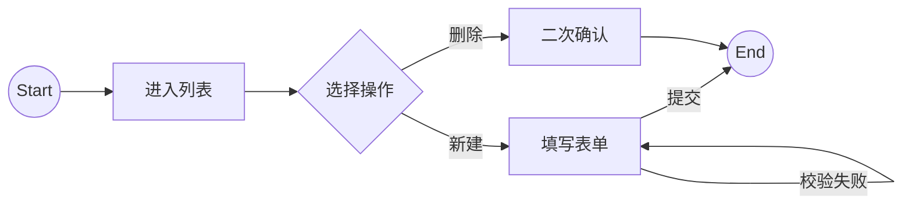

# PRD（完整稿）生成 Skill

面向 B 端后台功能，快速产出**可交付研发/测试**的 PRD 完整稿：PRD 大纲、字段/数据模型、状态机（动作/前置条件/失败分支）、权限点、异常与边界、以及验收用例清单。

默认输出：**完整稿写入文件**（`docs/current/modules/{模块名}/PRD_{模块名}.md`），对话中只呈现摘要和 Handoff。

> 目标：用**最少的澄清**拿到足够信息；用**固定模板**输出一致质量；用**决策点列表**避免"拍脑袋默认"。

---

## Q0：是否有项目层需求规范覆盖？（每次开始前先检查）

1. **优先通过知识库索引定位**
   - 调用 `project-knowledge` skill 或直接读取 `docs/current/Index.md`
   - 使用关键词检索定位相关模块的文档（PRD、DESIGN、SPEC）
   - 检查 `docs/current/modules/` 是否有相关模块的 `DESIGN_*.md` 文档
   - 检查 `docs/current/common/` 是否有共用的设计文档
   - 若存在已发布的 DESIGN 文档，继承其中已定义的数据模型、状态机、技术方案

2. **其次检查 `.cursor/rules/` 目录**
   - 检查 `./.cursor/rules/requirements/` 是否存在；存在则使用项目要求
   - 若项目不存在，则检查全局 rules 目录（`~/.cursor/rules/requirements/`）
   - **存在** → 按以下顺序读取（文件不存在则跳过）：
     1. `overrides/domain-terms.md` → 用项目术语替换通用表达
     2. `overrides/prd-template.md` → 用项目模板覆盖/裁剪 PRD 模板节
     3. `additions/business-rules.md` → 追加到 PRD 的约束与规则
     4. `additions/entities.md` → 预填充数据模型字段，减少澄清问题
     5. `additions/scenarios.md` → 作为典型场景参考输入

3. **均不存在** → 直接使用 PRD 模板，无需额外操作

---

## 0) 文件输出步骤

1. 检查 `docs/current/modules/{模块名}/` 目录是否存在；不存在则创建：
   ```
   mkdir -p docs/current/modules/{模块名}
   ```
2. 按第 3 节模板生成完整 PRD Markdown 内容
3. 用 Write 工具写入 `docs/current/modules/{模块名}/PRD_{模块名}.md`
3.5 执行「需求匹配度自检」

   对照用户原始输入的需求描述，逐项检查已生成的 PRD 内容：

   **覆盖度检查**：原始需求中每个明确提到的功能点，是否在 PRD 中有对应的章节或条目？标记未覆盖项。

   **逻辑一致性检查**：
   - 状态机的转移规则是否自洽（无死状态、无矛盾转移）
   - 权限点与功能需求是否对应
   - 异常边界是否与功能需求中涉及的操作一致

   **完整性检查**：以下必要节是否存在且非空：
   - 数据模型字段表
   - 状态机表格
   - 验收用例（按功能分组，含失败路径）
   - 决策点列表

   自检结论以结构化格式追加到 PRD 文件末尾，未通过项直接在 PRD 中补全，不单独输出报告。

4. 在对话中只输出以下格式的摘要（不展开完整内容）：

```
## Stage 2 完成 — PRD

文件已写入：docs/current/modules/{模块名}/PRD_{模块名}.md

### 摘要
- 核心实体：{实体名}，{N} 个字段
- 状态机：{N} 个状态，{M} 条转移规则
- 关键权限点：{1-2 个最重要的权限边界}
- 决策点：{N} 个，其中 {X} 个有推荐默认
- 需求覆盖度：{N}/{M} 个需求点已覆盖，{X} 个补全

### Handoff → Superpowers（设计头脑风暴）
- 页面清单：{页面数量和名称}
- 核心交互规则：{1-3 条最影响设计的规则}
- 异常态要求：{需要设计覆盖的异常场景数}
- 关键决策点：{需要确认的技术/业务决策}

> 建议下一步调用 `brainstorming` skill 辅助进行设计头脑风暴，输出 SPEC 文档至 `docs/superpowers/specs/`

---

## 1) 高效产出路径

1. **把需求压缩到 1 句话目的**
   - 用户是谁、在什么压力下、要完成什么任务（1 句话）
2. **定边界**
   - 本期做什么/不做什么（MVP vs 二期）
2.5 **画 IA 图和用户流程图**（Mermaid）
   - IA：模块入口 → 列表页 → 详情/编辑/弹窗的层级
   - 流程图：主路径操作步骤 + 异常/失败分支（含 Gate）
3. **列实体与字段**
   - "管理谁？"→ 先把实体字段表列出来（决定后面 UI/接口/验收）
4. **画状态机**
   - 状态枚举 → 允许动作 → 前置条件 → 失败分支 → 恢复策略
5. **补权限与审计**
   - 权限点 + 风险操作（二次确认/审计/幂等）
6. **补异常与边界**
   - 空/错/慢/权限不足/导入失败/长文本/多标签/并发点击
7. **写验收**
   - DoD（功能+质量）→ 用例（按功能分组，覆盖 happy path + 错误路径）
8. **列决策点**
   - 软删/硬删、发布是否校验/审批、导入默认状态、筛选是否多选等

> 原则：**不要替用户"编业务"**。遇到策略分歧，写成"决策点"，并给推荐默认与影响。

---

## 2) 澄清清单（尽量少问，但必须问对）

当信息缺失时，优先问以下"高杠杆问题"（最多 6 个）：

1. **目标用户/角色**：谁用？（运营/分析师/管理员）
2. **核心目标**：最重要的 1~2 件事是什么？（新建发布、搜索复用、治理）
3. **生命周期**：状态有哪些？（草稿/已发布/已下线/待审核…）
4. **风险策略**：删除软删还是硬删？发布是否需要校验/审批？
5. **导入策略**：导入后默认状态？归类规则？重复如何处理？
6. **权限模型**：最少需要哪些权限点？是否需要审计日志？

---

## 3) PRD 输出模板

按以下模板生成完整内容并写入文件（按需要增删小节，但不能缺少"状态机/验收/决策点"）：

```markdown
# <功能名> PRD（完整稿）

**版本**：V1.0（MVP）
**模块**：<模块/子系统>

## 1. 背景与目标
### 1.1 背景
### 1.2 目标（MVP）
### 1.3 非目标（本期不做）

## 2. 术语与定义

## 3. 用户与使用场景
### 3.1 角色
### 3.2 典型场景

## 4. 信息架构与页面

### 4.0 IA 图（信息架构）
> 展示模块导航层级和页面归属关系。


### 4.1 用户流程图（User Flow）
> 覆盖主路径 + 至少 1 条异常路径。


### 4.2 页面清单
### 4.3 页面布局要点（可交付研发）

## 5. 数据模型（字段定义）
### 5.1 核心实体（表格）
### 5.2 附属实体（可选）

## 6. 核心功能需求
### 6.1 列表/卡片展示字段
### 6.2 创建/编辑/复制/删除
### 6.3 搜索/筛选/排序
### 6.4 导入/导出（如适用）

## 7. 状态机（表格）
### 7.1 状态枚举
### 7.2 状态转移与动作规则（含失败提示）

## 8. 权限与安全
### 8.1 权限点（最小集）
### 8.2 风险操作策略（二次确认/审计/幂等/回滚）

## 9. 异常与边界（必须覆盖）
### 9.1 空态
### 9.2 加载态
### 9.3 错误态（401/403/5xx/导入失败等）
### 9.4 长文本/多标签/大量数据/并发点击

## 10. 埋点与指标（可选）

## 11. 验收标准（DoD）
### 11.1 功能 DoD
### 11.2 质量 DoD

## 12. 验收用例清单（测试可直接用）
（按功能分组，覆盖成功/失败/权限/并发）

## 13. 决策点（需要拍板 + 默认建议）
```

---

## 4) 状态机写法规范（避免漏与歧义）

状态机表格最少包含这些列：
- 当前状态
- 动作（用户触发 or 系统触发）
- 目标状态
- 前置条件（权限/校验/依赖资源）
- 失败分支（错误码/原因类目）
- 失败提示（用户可理解的文案）
- 幂等/回滚策略（可选但推荐）

---

## 5) 验收用例生成规则（从 PRD 自动推导）

> 验收用例须符合 `docs/current/SPEC_Test.md` 定义的测试策略、命名规范及覆盖率要求。

按以下结构生成用例（每组不少于 3 条：成功/失败/权限）：
- 列表与展示
- 搜索
- 筛选与排序
- 新建/编辑
- 导入（如有）
- 发布/取消发布/删除（风险操作）
- 权限矩阵
- 错误与恢复（网络/5xx/超时）
- 边界（长文本、多标签、大数据、并发点击）

---

## 6) 默认建议（用于决策点的"推荐值"）

- 删除：默认 **软删**（利于审计与误操作恢复）
- 导入：默认 **未发布**（避免误发布）
- 发布：默认 **强校验**（至少名称/类型/关键结构）
- 筛选：MVP 默认 **单选**，二期再做多选
