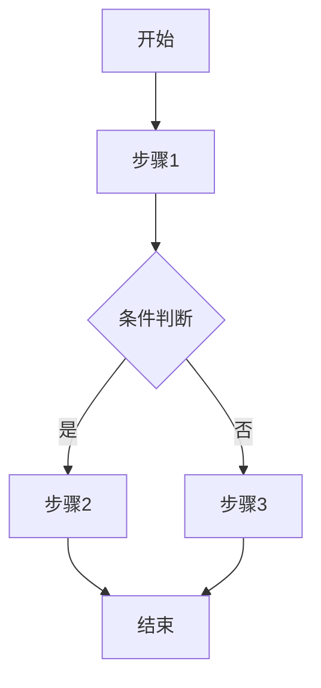

# 设计文档 Release 流程

将研发过程中产生的中间设计文档归档至权威文档目录，作为最终验收文档。

## 何时使用

- 功能研发完成后（代码已实现、测试已通过）
- Bug 修复导致设计变更后
- 需求变更导致设计文档需要更新时
- 重构完成后需要更新架构说明时

---

## 目录约定

Release 流程涉及两类文档目录：

| 目录类型 | 定位 | 常见命名 |
|----------|------|----------|
| **权威文档** | 与代码同步的正式文档 | `docs/current`、`docs/design` |
| **过程文档** | 研发过程的草案与计划 | `docs/specs`、`docs/drafts`、`docs/plans` |

> 执行 Release 前，需先识别项目具体使用的目录命名。

---

## Release 检查清单

```
Release 进度：
- [ ] Step 1: 确认研发状态
- [ ] Step 2: 识别文档目录结构
- [ ] Step 3: 识别需要 Release 的文档
- [ ] Step 4: 判断 Release 类型
- [ ] Step 5: 执行文档 Release
        - [ ] 5.1 确定目标位置
        - [ ] 5.2 精简文档内容
        - [ ] 5.3 归档文档结构（更新已有章节 / 新增文档模板）
- [ ] Step 6: 更新代码注释中的文档引用
- [ ] Step 7: 标记原文档状态
```

---

## Step 1: 确认研发状态

Release 前 **必须** 确认：

| 检查项 | 要求 | 验证方式 |
|--------|------|----------|
| 代码实现 | 已完成并通过测试 | 运行测试确认 |
| 测试覆盖 | 新增/修改的功能有对应测试 | 检查测试文件 |
| 设计文档 | 存在于过程文档目录 | 查看目录 |

**禁止**：在代码未完成或测试未通过时进行 Release。

---

## Step 2: 识别文档目录结构

检查项目的 `docs/` 目录，识别：

1. **权威文档目录位置**（归档目标）
2. **过程文档目录位置**（归档来源）
3. **项目文档命名约定**（如 `DESIGN_`、`SPEC_` 等前缀）

---

## Step 3: 识别需要 Release 的文档

从过程文档目录查找本次研发相关的文档，判断是否需要 Release：

| 文档类型 | 是否 Release | 说明 |
|----------|--------------|------|
| 设计草案/讨论稿 | ✅ 需要 | 提取核心设计内容归档 |
| 实现计划 | ❌ 通常不需要 | 保留作为历史记录 |
| 需求文档 | ⚠️ 视情况 | 若包含核心功能定义则归档 |
| 会议记录 | ❌ 不需要 | 保留作为历史记录 |

> **归档路径规则（必须遵守）**：
> - `*_design.md` 或 `*_spec.md` → 归档到 `docs/current/modules/<Module>/DESIGN_<Module>.md` 或 `docs/current/common/<Module>/DESIGN_<Module>.md`
> - `*_plan.md` → **不归档**，保留在 `docs/superpowers/plans/` 作为历史记录
> - **禁止** 将技术实现细节（API 详细设计、数据库表结构、代码等）放入 `PRD_` 文档

---

## Step 4: 判断 Release 类型

根据权威文档目录中是否已有相关文档，选择 Release 类型：

### 类型 A：新增文档

权威文档目录中不存在对应模块的设计文档时。

**适用场景**：
- 新模块研发
- 新规范制定
- 新架构组件引入

### 类型 B：合入已有文档

权威文档目录中已存在相关设计文档时。

**合入原则**：

| 操作 | 适用内容 |
|------|----------|
| **更新已有章节** | 优先在现有章节中补充/修改内容，而不是新增章节 |
| **保留** | 已有文档的核心架构、整体流程说明 |
| **补充** | 新增的功能点、扩展的逻辑分支 |
| **更新** | 版本信息、修改日期、变更说明 |
| **标注废弃** | 已移除的功能（注明废弃原因和替代方案） |

> **重要**：优先选择"更新已有章节"，只有在以下情况才考虑新增章节：
> - 新增功能无法融入现有章节结构
> - 功能复杂度需要独立章节来组织
> - 现有章节已经过长需要拆分 |

---

## Step 5: 执行文档 Release

### 5.1 确定目标位置

遵循项目已有的文档命名约定。常见模式：

| 前缀 | 用途 | 说明 |
|------|------|------|
| `PRD_` | 需求文档 | 产品需求定义，**不存放技术实现细节** |
| `DESIGN_` | 设计文档 | 通用设计说明，包含技术实现细节 |
| `DESIGN_FE_` | 前端设计 | 前端专属设计 |
| `DESIGN_BE_` | 后端设计 | 后端专属设计 |
| `SPEC_` | 规范文档 | 编码/架构规范 |
| `TEST_` | 测试文档 | 测试策略/方案 |

> **重要**：
> - `docs/superpowers/specs/*_design.md` → 归档到 `docs/current/modules/<Module>/DESIGN_<Module>.md` 或 `docs/current/common/<Module>/DESIGN_<Module>.md`
> - `docs/superpowers/plans/*_plan.md` → **不归档**，保留在 superpowers 中
> - **禁止** 将 API 详细设计、数据库表结构、代码等放入 `PRD_` 文档

### 5.2 精简文档内容

归档文档应聚焦于「说明」，而非「讨论」：

| 过程文档内容 | 归档文档处理 |
|--------------|--------------|
| 问题分析、背景讨论 | 精简为一句话概述 |
| 多方案对比、权衡过程 | 只保留最终选择及理由 |
| 详细实现步骤、伪代码 | 概述核心逻辑，标注代码位置 |
| 待办事项、TODO | 删除（已完成） |

### 5.3 归档文档结构建议

归档时，**优先更新已有章节**（Type B），而不是新增章节。

#### Type B：更新已有章节（推荐）

```markdown
## X.Y 章节名称

[在现有章节中补充/修改内容]

**新增补充**：
- 要点1：具体说明
- 要点2：具体说明
```

> 示例：在 `DESIGN_FE_Browser_Extension_Management.md` 的 §6.2 导入流程中补充命名规则。

#### Type A：新增文档时使用以下模板

```markdown
# <模块名> 设计文档

## 1. 概述
[模块定位、核心功能简介]

## 2. 核心设计
[关键架构决策、数据结构、算法选择]

## 3. 表结构
[数据库表结构设计，如有]

## 4. 流程说明
[关键业务流程的描述，使用 Mermaid 流程图]



## 5. 接口/API

### 5.1 接口定义

| 属性 | 值 |
|------|------|
| 方法 | `GET/POST/PUT/DELETE` |
| 路径 | `/api/v1/xxx` |
| 说明 | 接口说明 |
| 认证 | Required |

#### 请求参数

| 参数名 | 类型 | 必填 | 说明 |
|--------|------|------|------|
| page | Integer | 否 | 页码，默认 1 |
| size | Integer | 否 | 每页条数，默认 10 |

#### 响应参数

| 参数名 | 类型 | 说明 |
|--------|------|------|
| data | Object | 响应数据 |
| $page | Integer | 当前页码（分页时） |
| $size | Integer | 每页条数（分页时） |
| total | Long | 总条数（分页时） |

#### 请求/响应示例

```http
GET /api/v1/xxx

响应：
{
  "data": {...}
}
```

---

## 6. 核心代码位置
[标注关键实现文件路径，便于溯源]

> **原则**：保持文档结构稳定，避免章节膨胀。更新已有文档时应该精炼内容，而不是叠加。

---

## Step 6: 更新代码注释中的文档引用

在核心代码文件中添加文档引用注释，建立代码与文档的双向链接。

**示例**：

```java
/**
 * <类功能说明>
 * @see docs/current/modules/<Module>/DESIGN_<Module>.md
 * @see docs/current/common/<Module>/DESIGN_<Module>.md
 */
public class AuthService { ... }
```

```typescript
/**
 * <模块功能说明>
 * @see docs/current/modules/<Module>/DESIGN_<Module>.md
 * @see docs/current/common/<Module>/DESIGN_<Module>.md
 */
export const useUserStore = () => { ... }
```

**适用范围**：
- 复杂业务逻辑类
- 核心配置类
- 新增的重要服务类
- 架构关键组件

---

## Step 7: 标记原文档状态

在过程文档目录的原文件中添加归档标记，保留研发过程的可追溯性。

### 标记方式

在原文件顶部更新状态字段：

```markdown
**状态**: 已归档 → docs/current/modules/<Module>/DESIGN_<Module>.md 或 docs/current/common/<Module>/DESIGN_<Module>.md
```

### 为什么保留原文件？

| 场景 | 价值 |
|------|------|
| 排障时 | 查阅当初的设计决策过程 |
| 需求变更评审 | 对比当初讨论的备选方案 |
| 新成员理解 | 追溯功能演进历史 |

> **禁止**：删除过程文档目录中的原文件。它们是研发历史的记录。

---

## 注意事项

### 禁止事项

- ❌ 删除过程文档目录中的原文件
- ❌ Release 未通过评审的设计草案
- ❌ 用过程文档替代权威文档作为真源
- ❌ 归档包含大量伪代码的文档（应精简）
- ❌ 将设计文档（`*_design.md`）归档到 `PRD_` 文档中（应归档到 `DESIGN_*.md`）
- ❌ 将技术实现细节（API 详细设计、数据库表结构、代码）放入 `PRD_` 文档

### 最佳实践

- ✅ Release 前先阅读权威文档目录中已有文档，理解现有结构
- ✅ 合入时保持文档风格一致
- ✅ 归档后运行测试，确保代码仍正常工作
- ✅ 提交时使用明确的 commit message

---

## 提交建议

```bash
git add docs/<权威目录>/              # 归档的权威文档
git add docs/<过程目录>/<原文件>       # 更新的状态标记
git commit -m "docs: Release <功能名> 设计文档"
```