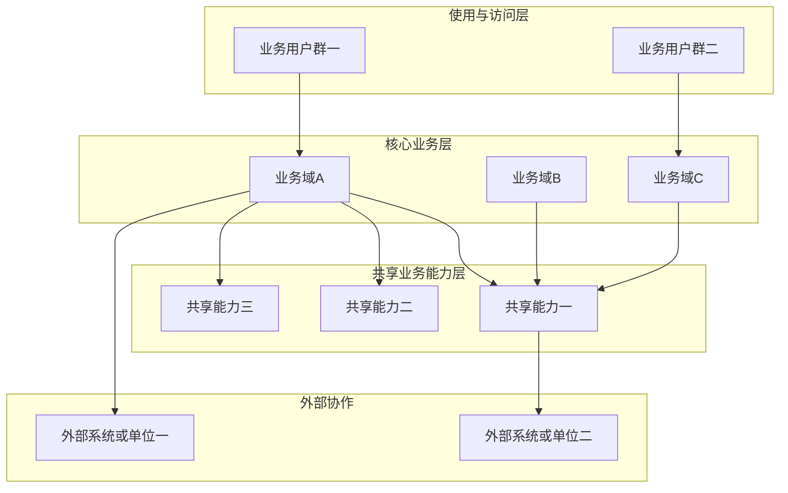

# [产品/功能模块名称] 产品概要说明书

> 版本：v1.0 · 状态：草稿 / 评审中 / 已定稿 · 适用迭代：[迭代名称/期数]
>
> 关联文档：[如有白皮书、界面说明、各菜单需求文档路径等在此引用]

---

## 一、概述

### 1.1 背景与现状

#### 业务场景

[描述用户在什么场景下遇到什么问题，当前是如何解决的，痛点是什么。可以从以下角度展开：]

- **使用主体**：[涉及哪些用户角色或系统角色？]
- **核心诉求**：[用户最想达成的目标是什么？]
- **现有方案及局限**：[当前已有的能力或替代方案，存在哪些不足？]

#### 现状的核心问题

[逐条列出当前需要解决的关键问题，每条一句话说清「是什么问题 + 为什么是问题」：]

1. **问题一**：[描述]
2. **问题二**：[描述]
3. …

#### 解决方案目标

[1～2 段话概括本次解决方案的核心思路，说明如何系统性解决上述问题。]

### 1.2 产品目标

[以 bullet list 列出本次要实现的核心目标，每个目标一句话，可量化尽量量化：]

- **目标一**：[描述]
- **目标二**：[描述]
- …

### 1.3 术语表

> 定义本文档中使用的关键术语，帮助读者对齐理解。

| 术语 | 含义 |
| :--- | :--- |
| [术语1] | [清晰、无歧义的定义] |
| [术语2] | [清晰、无歧义的定义] |

---

## 二、角色与权限

### 2.1 角色定义

| 角色 | 职责描述 | 主要使用方式（业务入口） |
| :--- | :--- | :--- |
| [角色1] | [该角色在本产品中的职责] | [如：协调指挥工作台、值班值守、外单位回执等，不写技术路径] |
| [角色2] | [描述] | [描述] |

### 2.2 权限矩阵

> 明确各角色可执行的操作，便于评审权限边界；页面级细矩阵可在各菜单需求文档中展开。

| 操作 | [角色A] | [角色B] | [角色C] |
| :--- | :--- | :--- | :--- |
| [操作1] | ✓ / - / 条件 | ✓ / - / 条件 | ✓ / - / 条件 |
| [操作2] | ✓ / - / 条件 | ✓ / - / 条件 | ✓ / - / 条件 |

---

## 三、系统的整体架构与主流程

> 本章从**业务与能力**角度描述「系统由哪些部分构成、主链路如何闭环」，不描述前后端实现、接口与代码结构。

### 3.1 系统总体架构

> **模板用法**：本节须给出**一张总体架构图**（可 Mermaid、可插入图片）及**分层/分块说明**。图中节点一律为**业务域、能力群或使用主体**名称；**不写**部署拓扑、技术组件、接口、框架、源码路径。分层数量与命名可按项目裁剪。

**架构图（请替换占位为实际业务名称，并调整连线）：**

**架构说明（逐项填写，可增删小节）：**

| 序号 | 图中位置 | 填写要求 |
| :--- | :--- | :--- |
| 1 | 使用与访问层 | [填写：使用主体类型、典型业务入口形态（如工作台/管理端）；不写 URL、不写终端型号除非合同要求] |
| 2 | 核心业务层 | [填写：各业务域与菜单/子域的对应关系；域之间**业务上**的依赖或产出关系，一句话即可] |
| 3 | 共享业务能力层 | [填写：跨域复用的能力名称与统一原则；避免与各域需求文档重复写细字段] |
| 4 | 外部协作层 | [填写：组织边界外的协作方及**业务级**依赖/产出；技术对接见**第七章**] |

**一致性**：更新架构图后，须核对 **「四、菜单与需求文档索引」** 中的菜单与需求文档引用是否仍与本节一致。

### 3.2 系统级主流程（端到端）

> 描述跨角色、跨模块的**主成功路径**（从触发到归档或闭环）；分支与异常以业务语言简述。

1. **[阶段一]**：[谁、在什么业务条件下、完成什么业务动作]
2. **[阶段二]**：…
3. **[终态]**：[业务上如何判定「已闭环」]

[可选：用 ASCII 或流程图工具补充「主流程」示意图，不出现接口名、类名、文件名。]

### 3.3 与外部协作的关系（业务级）

| 外部协作方 | 业务上依赖什么 | 本平台对外提供什么（业务结果） | 备注 |
| :--- | :--- | :--- | :--- |
| [单位/系统/平台名称] | [如：身份、台账、回执] | [如：通报备案、统计口径] | [责任边界一句话] |

---

## 四、菜单与需求文档索引

> 用下表维护**菜单**与**对应需求文档**的映射，便于评审与追溯。

| 菜单名称 | 说明 | 菜单目录 | 需求文档路径 |
| :--- | :--- | :--- | :--- |
| [具体菜单项名称] | [该目录下能力概述] | [一级/二级菜单目录名] | [需求文档路径] |

---

## 五、非功能需求（NFR）

### 5.1 性能

| 指标 | 目标值 | 备注 |
| :--- | :--- | :--- |
| [关键业务操作] 响应/完成时间 | [如：P95 ≤ XXXms 或业务可接受时限] | [备注条件] |
| [主要工作台/列表] 可用体验 | [如：首屏可交互 ≤ Xs] | [备注] |
| 并发与容量 | [数量 / 场景] | [说明] |

### 5.2 可用性

| 检查项 | 目标 / 要求 |
| :--- | :--- |
| 核心功能可用性 | [如 ≥ 99.9%] |
| 单点故障影响 | [故障时对已下发/已存在数据的影响] |
| 降级方案 | [功能异常时的兜底策略] |

### 5.3 安全

| 检查项 | 要求 |
| :--- | :--- |
| 权限控制 | [敏感操作的权限模型] |
| 数据安全 | [敏感数据存储、传输的加密要求] |
| 审计追溯 | [必须记录审计日志的操作清单] |
| 合规要求 | [涉及的合规标准及要求] |

### 5.4 兼容性

| 检查项 | 要求 |
| :--- | :--- |
| 存量数据/配置 | [是否兼容已有数据，是否需要迁移] |
| 对既有约定/口径的兼容 | [是否有破坏性变更，如何处理] |
| 客户端环境 | [支持的浏览器或终端环境版本（业务可理解表述）] |

### 5.5 可维护性

| 检查项 | 要求 |
| :--- | :--- |
| 日志 | [关键操作日志级别和内容要求] |
| 监控告警 | [需要监控的指标和告警阈值] |
| 配置管理 | [配置变更的可追溯性要求] |

### 5.6 可测试性

| 检查项 | 说明 |
| :--- | :--- |
| 测试环境要求 | [是否需要特殊环境或工具] |
| 测试难点 | [边界场景、难以自动化的场景] |
| 测试数据 | [是否需要特殊数据准备] |

---

## 六、验收标准

> 汇总可独立验证的验收条款；可按菜单或能力域分类。细则可与各菜单需求文档中的 AC 互链。

### 6.1 功能验收

| 编号 | 所属模块/菜单 | 验收场景 | 前置条件 | 操作步骤 | 预期结果 |
| :--- | :--- | :--- | :--- | :--- | :--- |
| AC-01 | [模块或菜单名] | [场景描述] | [前置条件] | [操作步骤] | [预期结果] |
| AC-02 | [模块或菜单名] | [场景描述] | [前置条件] | [操作步骤] | [预期结果] |

### 6.2 关联能力变更验收

| 编号 | 关联功能 | 验收场景 | 前置条件 | 操作步骤 | 预期结果 |
| :--- | :--- | :--- | :--- | :--- | :--- |
| AC-XX | [功能名] | [场景描述] | [前置条件] | [操作步骤] | [预期结果] |

### 6.3 非功能需求验收

| 编号 | 类别 | 验收场景 | 验收标准 | 测试方法 |
| :--- | :--- | :--- | :--- | :--- |
| AC-XX | 性能 | [场景] | [标准] | [方法] |
| AC-XX | 安全 | [场景] | [标准] | [方法] |
| AC-XX | 兼容性 | [场景] | [标准] | [方法] |

---

## 七、外部依赖

| 依赖系统 / 服务 | 用途（业务视角） | 对接形态（可选） | 对接状态 |
| :--- | :--- | :--- | :--- |
| [系统名称] | [在本产品中的作用] | [如：同步查询 / 消息 / 文件交换] | 既有复用 / 需改造 / 待对接 |
| [系统名称] | [用途] | [形态] | [状态] |

---

## 八、版本与变更记录

### 8.1 功能变化（本版本相对上一版本）

| 序号 | 变化类型 | 涉及菜单或业务功能 | 相对上一版本的变化说明 | 关联需求文档占位（可选） |
| :--- | :--- | :--- | :--- | :--- |
| [序号] | [填写] | [填写] | [填写] | [填写] |

---

## 九、附录

### 9.1 业务异常与提示口径（可选）

> 产品概要阶段可只列**业务类别**；具体错误码与各接口说明放在菜单级需求文档或专项设计。

| 业务异常类别 | 典型触发场景 | 面向用户的提示原则 |
| :--- | :--- | :--- |
| [类别] | [场景] | [原则或示例话术方向] |

### 9.2 审计事件清单（如涉及）

| 事件类型 | 触发时机 | 关键信息（业务字段口径） |
| :--- | :--- | :--- |
| [EventName] | [何时记录] | [记录哪些关键信息] |
